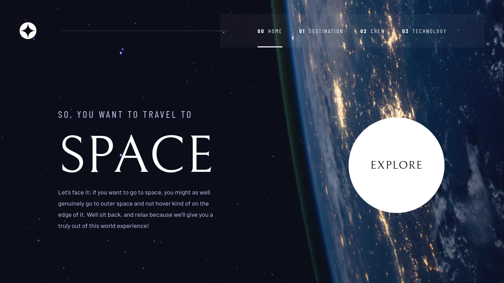

# 🌌 Space Tourism Website



## 📄 Description

Explore the cosmos with our compact space website! Journey through celestial wonders, from captivating images to intriguing facts, all in one convenient space. Embark on a cosmic adventure today!

## 🔗 Links

-   Project Link: 

## 🛠 Technologies Used

-   [React](https://reactjs.org/)
-   [TypeScript](https://www.typescriptlang.org/)
-   [Styled Components](https://styled-components.com/)
-   [React Router](https://reactrouter.com/)
-   [React Query](https://github.com/TanStack/query)
-   [Eslint](https://eslint.org/)
-   [Prettier](https://prettier.io/)
-   [EditorConfig](https://editorconfig.org/)
-   [Vite](https://vitejs.dev/)

## 🚀 How to Run

```bash
# Clone this repository
$ git clone https://github.com/arsenbadalyan/space-tourism-website

# Navigate to the project folder in the terminal/cmd
$ cd space-tourism-website

# Install the dependencies
$ npm install

# Run the project
$ npm run dev
